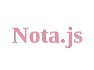
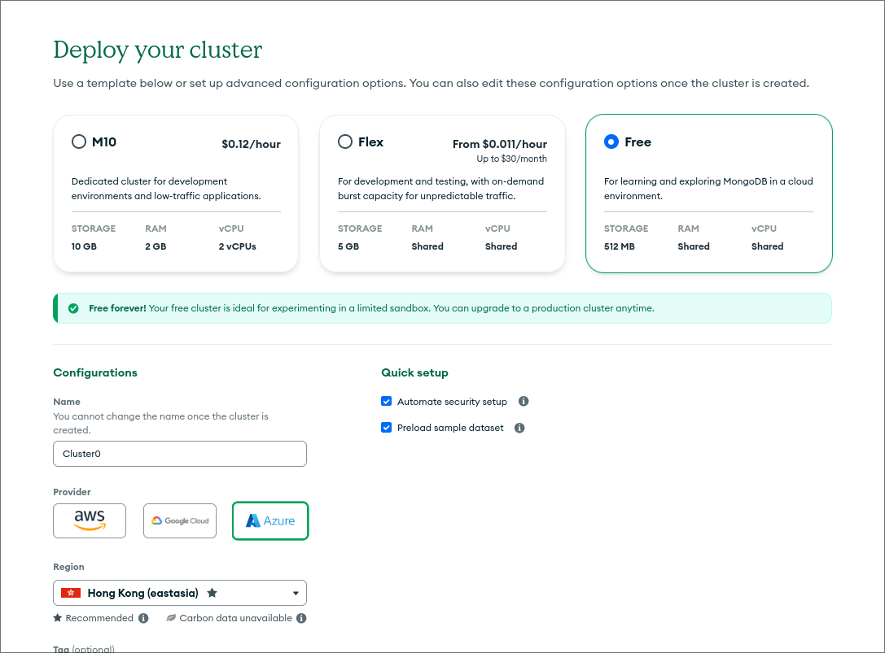
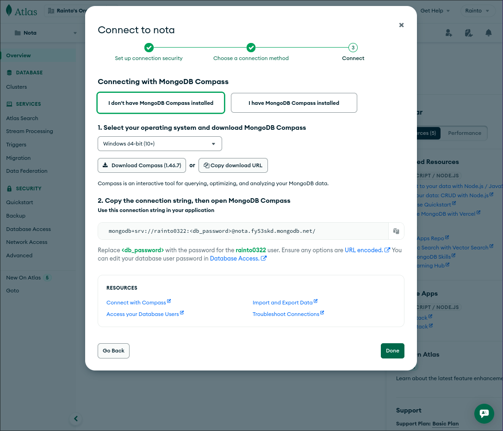
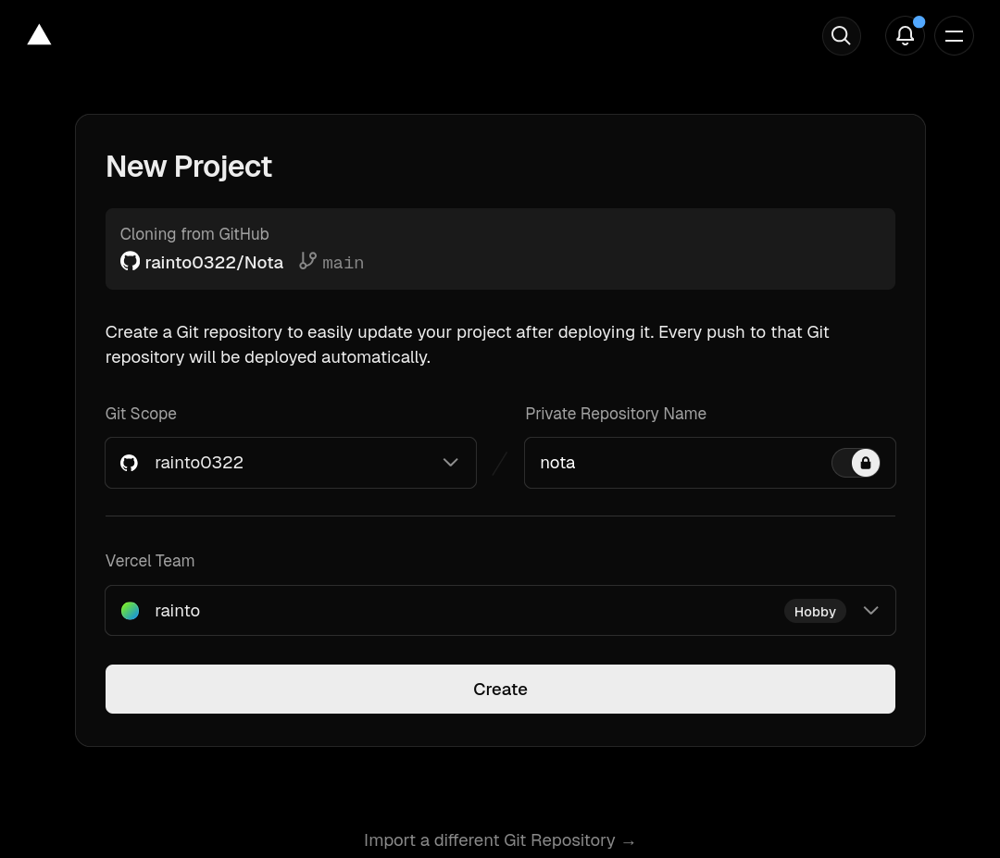
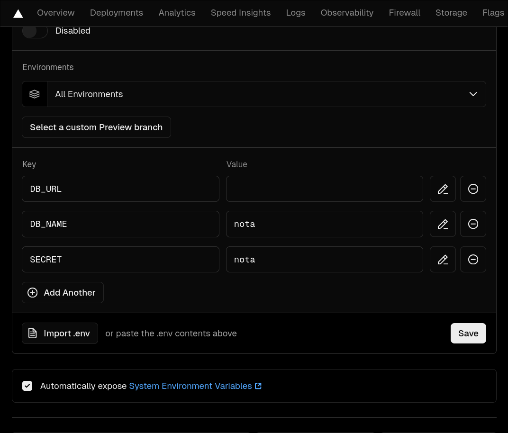

⚡ Fast and minimalist web server , for [@Elysia](https://elysiajs.com/) and [@MongoDB](https://www.mongodb.com/) .

## What is Nota

Nota `[/ˈnɔ.ta/​​]` in Latin, it means notes. This is a `RESTful` blog API implemented using [@Elysia](https://elysiajs.com/) and [@MongoDB](https://www.mongodb.com/).

## 🚴‍♂️ Getting started
> ⚠️ Vercel cannot use Bun runtime, there will be performance degradation.

### 1. Get a Mongo database
> 🤓 If you don't have a server, you can get a free MongoDB (512MB) from ***[Mongodb Altas](https://www.mongodb.com/)***

1.1 create a free cluster (Recommend Azure's Hong Kong node)

1.2 Get MongoDB url

### 2. Deploy to Vercel

2.1 New vercel project

2.1. Go dashboard setting

>  your environment in `.env` and import 

> ⚠️ If you are in China, you may also need to set up a domain

2.2 Go Deployments and Redeploy
